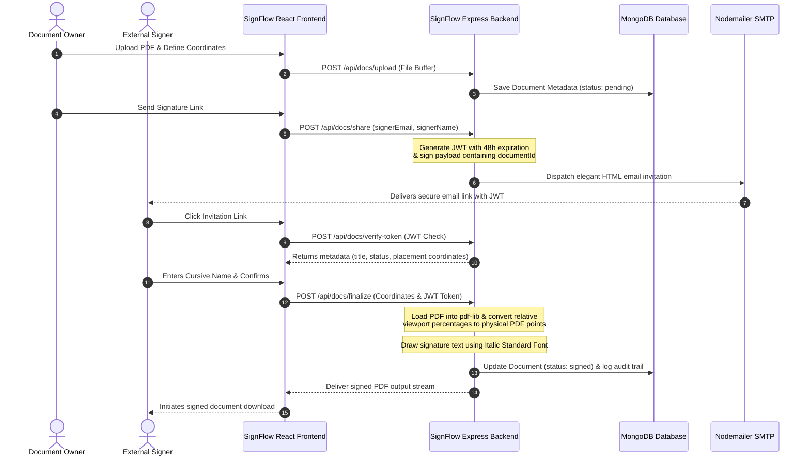

# SignFlow - Enterprise SaaS Document Signature Platform

[](https://www.typescriptlang.org/)
[](https://react.dev/)
[](https://nodejs.org/)
[](https://www.mongodb.com/)
[](https://tailwindcss.com/)
[](https://clerk.com/)

SignFlow is a high-performance, enterprise-ready digital signature SaaS application built on a fully typed MERN stack with TypeScript. Designed with professional ergonomics, it enables tenants to upload PDF contracts, drag or custom-draw resize coordinates, send secure tokenized signature invitations to external public signers, configure rejection workflows, and inspect cryptographic-grade immutable audit timelines.

---

## 🏗️ Architecture & High-Level System Flow

The system orchestrates multi-tenant SaaS features across secure authentication boundaries. The sequence diagram below maps the tokenized external signing lifecycle and server-side compilation:



---

## 📐 Relative Coordinate Resolution Engine

To prevent signature overlays from shifting when documents are viewed across different device viewports, desktop sizes, or browser zooms, SignFlow uses a **Relative Coordinate Tracking Engine**.

### Viewport Normalization Matrix
To handle cross-device responsiveness, raw screen pixel drop coordinates are normalized into strict percentages relative to the dynamic parent PDF viewport wrapper before storing them in MongoDB:

$$x_{\%} = \left( \frac{\text{dropped\_x\_pixels}}{\text{pdf\_render\_width}} \right) \times 100$$

$$y_{\%} = \left( \frac{\text{dropped\_y\_pixels}}{\text{pdf\_render\_height}} \right) \times 100$$

### Y-Axis Coordinate Inversion
Web viewports use a top-left origin $(0, 0)$ with $y$ values increasing downwards, whereas standard PDF specifications use a standard Cartesian coordinate system with a bottom-left origin $(0, 0)$ where $y$ values increase upwards.

The target vertical point $y_{pdf}$ is inverted precisely using:

$$y_{pdf} = \text{pageHeight} - \left( \frac{y_{\%}}{100} \times \text{pageHeight} \right) - \left( \frac{\text{height}_{\%}}{100} \times \text{pageHeight} \right)$$

### Backend Point Stamping
When processing via `pdf-lib` on the Node server layer, the fractional dimensions map seamlessly back to absolute PDF points:

$$\text{Final X} = \left( \frac{x_{\%}}{100} \right) \times \text{pageWidth}$$

$$\text{Final Width} = \left( \frac{\text{width}_{\%}}{100} \right) \times \text{pageWidth}$$

$$\text{Final Height} = \left( \frac{\text{height}_{\%}}{100} \right) \times \text{pageHeight}$$

This mathematical transformation guarantees sub-pixel accuracy and perfect overlay alignment on the output PDF document, regardless of the screen size of the user who signed it.

---

## 🚀 Key Feature Deliverables Checklist

### 🔑 Authentication & Tenancy
- [x] **Clerk Enterprise Authentication**: Fully integrated multi-tenant sign-in, signup, and session controls.
- [x] **Automated Database Syncing**: Middleware to intercept active tokens and sync profile metadata to MongoDB.

### 🎨 Signing & Placement Canvas
- [x] **Dual-Mode Canvas Engine**:
  - **Drag & Drop Mode**: Drag templates from a side-pane onto the active viewport (`dnd-kit`).
  - **Mouse Draw Mode**: Click and drag to create dynamic, MS Word-style custom layout signatures.
- [x] **Responsive Scaling Engine**: Scales signature overlay boxes instantly using relative layout calculations.
- [x] **Cursive Typing Font Generation**: Renders dynamic cursive handwriting styles directly inside signature placement previews.

### 📑 Document Lifecycle & Server Stamping
- [x] **PDF Page-Level Rendering**: Multi-page navigation utilizing client-side canvas PDF parsing.
- [x] **pdf-lib Stamp Compilation**: Merges cursive signatures dynamically into original PDF streams using `StandardFonts.TimesRomanItalic`.
- [x] **Secure File Upload Pipeline**: Multer-backed local storage file uploads.

### ✉️ Tokenized Public Invitations
- [x] **Unauthenticated Signing Links**: 48h JWT-signed secure signature URLs.
- [x] **Nodemailer HTML Template Dispatcher**: Automated emails containing invitation tokens.
- [x] **Verify Token Endpoint**: Extracts metadata from shared invitation JWTs to load public view states.

### 📋 Enterprise Audit & Rejection Flow
- [x] **IP & Browser Logging**: Captures client IP addresses and user agents dynamically.
- [x] **Immutable Audit Log Timeline**: Chronological log trail sorted newest-first for tracking document state changes.
- [x] **Signature Rejection Workflow**: Decline endpoints to reject documents, update status, and log reasons.

---

## 📂 Project Directory Structure

```text
DocSign/
├── frontend/                   # Frontend Vite + React + TypeScript App
│   ├── src/
│   │   ├── components/         # Reusable UI elements (Tabs, Timelines, Modals)
│   │   ├── pages/              # Main view pages (Dashboard, Canvas, Public Signer)
│   │   ├── App.tsx             # Route declarations and layout setup
│   │   └── index.css           # Global Tailwind CSS definitions
│   ├── .env                    # Frontend environment configuration
│   └── package.json
├── backend/                    # Backend Node.js + Express + TypeScript App
│   ├── src/
│   │   ├── config/             # Database connection configurations
│   │   ├── controllers/        # Document, Signature, and Audit Log handlers
│   │   ├── middlewares/        # Authentication checks and error handlers
│   │   ├── models/             # Mongoose Schemas (Document, AuditLog, User)
│   │   ├── routes/             # REST Route mappings
│   │   ├── utils/              # Audit Logging and PDF Stamping helpers
│   │   └── index.ts            # App entry point, CORS, and Port configurations
│   ├── .env                    # Backend environment configuration
│   └── package.json
└── README.md                   # Enterprise System Documentation
```

---

## 📋 API Endpoints Reference

| Category | HTTP Method | Path | Auth Scope | Payload Description |
| :--- | :--- | :--- | :--- | :--- |
| **Authentication** | `POST` | `/api/auth/sync` | `JWT Bearer` | Syncs active Clerk user profile metadata with MongoDB. |
| **Documents** | `GET` | `/api/docs` | `User Session` | Retrieves all document profiles owned by the logged-in user. |
| **Documents** | `POST` | `/api/docs/upload` | `User Session` | Uploads PDF contract using `multipart/form-data`. |
| **Documents** | `POST` | `/api/docs/share` | `User Session` | Generates 48h JWT tokens and sends invitations via Nodemailer. |
| **Documents** | `POST` | `/api/docs/verify-token`| `Public Link` | Verifies invitation JWTs to load metadata for anonymous signers. |
| **Documents** | `POST` | `/api/docs/finalize` | `Session/Token` | Stamps PDF with signature text and outputs finalized PDF bytes. |
| **Documents** | `POST` | `/api/docs/decline` | `Session/Token` | Rejects signing invitation and records `rejectionReason`. |
| **Signatures** | `POST` | `/api/signatures` | `User Session` | Persists layout coordinates `(x, y, w, h)` to database. |
| **Signatures** | `GET` | `/api/signatures/:id` | `Session/Token` | Fetches active coordinate mappings for placement previews. |
| **Audit Logs** | `GET` | `/api/audit/:id` | `User Session` | Fetches chronological audit logs for the specified document ID. |
| **Health** | `GET` | `/api/health` | `Public` | Service status checker. |

---

## ⚙️ Environment Configuration

### Backend Configuration (`backend/.env`)
Create a file at `backend/.env` containing:
```env
PORT=5000
MONGO_URI=mongodb://localhost:27017/signflow
CLERK_PUBLISHABLE_KEY=pk_test_...
CLERK_SECRET_KEY=sk_test_...
JWT_SECRET=your_super_secure_jwt_secret_key
FRONTEND_URL=http://localhost:3000
SMTP_HOST=smtp.ethereal.email
SMTP_PORT=587
SMTP_USER=your_smtp_username
SMTP_PASS=your_smtp_password
```

### Frontend Configuration (`frontend/.env`)
Create a file at `frontend/.env` containing:
```env
VITE_CLERK_PUBLISHABLE_KEY=pk_test_...
VITE_API_URL=http://localhost:5000
```

---

## 💻 Local Installation & Run Commands

### 1. Install Dependencies
Execute the install scripts in both subdirectories:
```bash
# Install backend dependencies
cd backend
npm install

# Install frontend dependencies
cd ../frontend
npm install
```

### 2. Launch Development Servers
Start both processes in concurrent terminals:
```bash
# Terminal 1: Spin up Backend (binds to http://localhost:5000)
cd backend
npm run dev

# Terminal 2: Spin up Frontend (binds to http://localhost:3000)
cd frontend
npm run dev
```

